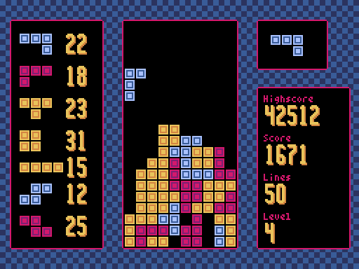

# Falling Blocks Game

A puzzle game made using the [Pyxel](https://github.com/kitao/pyxel) game engine.

## Screenshot



## How to Run the Game

To run this game both [Python](https://www.python.org/) and [Pyxel](https://github.com/kitao/pyxel) have to be installed on the system. To install Pyxel by following the [installation instructions](https://github.com/kitao/pyxel/blob/main/README.md#how-to-install) in the Pyxel repository. When everything is installed run these commands to download and start the game:

```
git clone https://github.com/henbr/falling_blocks_game.git
cd falling_blocks_game
python3 main.py
```

## Game Controls


| Key         | Description      |
| ----------- | ---------------- |
| Up arrow    | Rotate piece     |
| Left arrow  | Move piece left  |
| Right arrow | Move piece right |
| Down arrow  | Drop piece       |
| Q or Escape | Quit game        |
| P           | Pause the game   |
| S           | Screenshot       |
